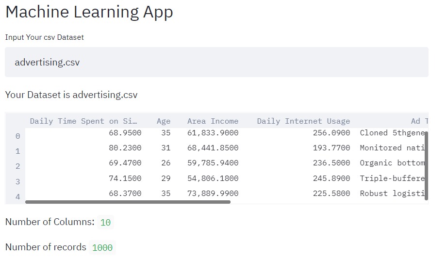
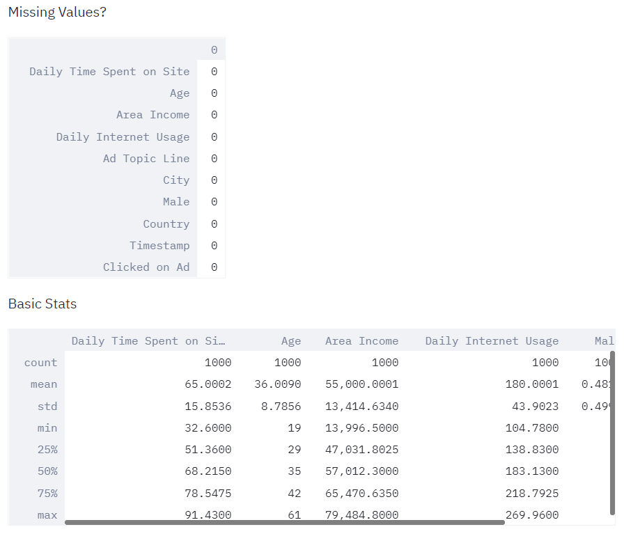
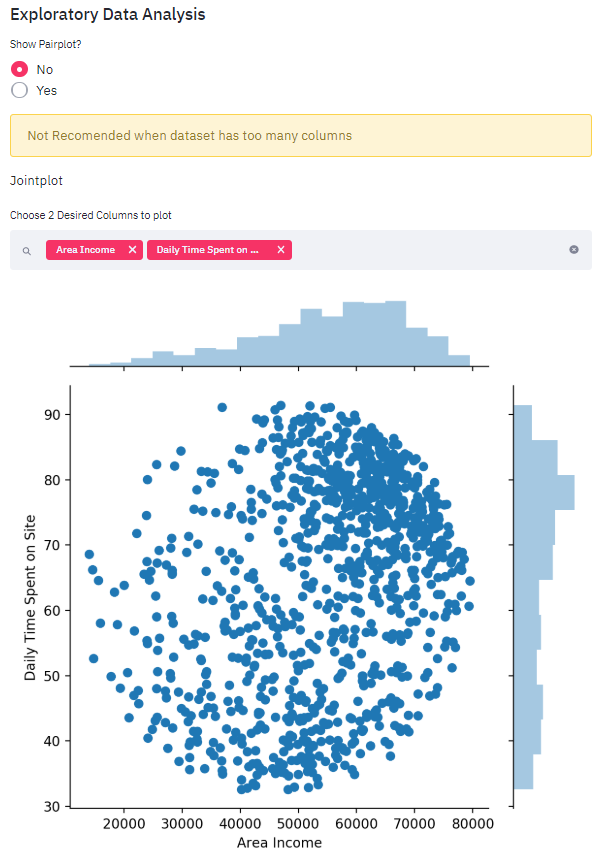
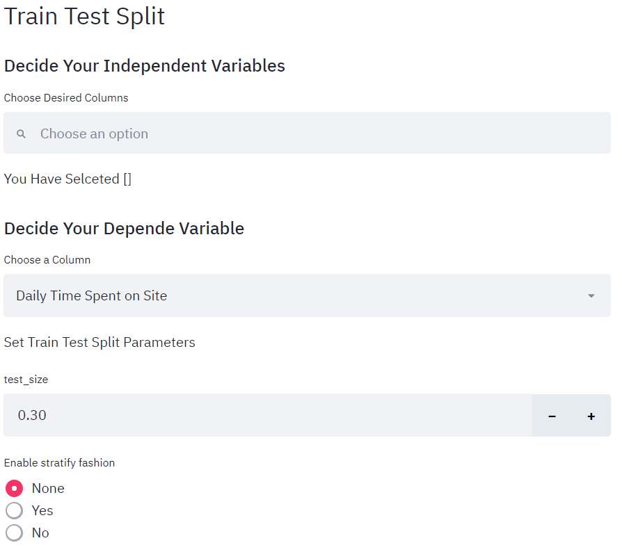
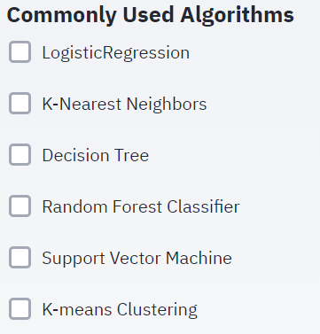

# CommonlyUsedAlgorithms
General Overview of the Iris App






# Installation

This repository is tested on Python 3.6+

Clone the repository


```sh
$ git clone https://github.com/CJtheSloth/iris_streamlit_app
$ cd streamlit_iris
```

Install the dependencies

```sh
$ pip install pandas streamlit matplotlib scikit-learn
```

Run the application on `http://localhost:8501/`

```sh
$ streamlit run iris.py
```
